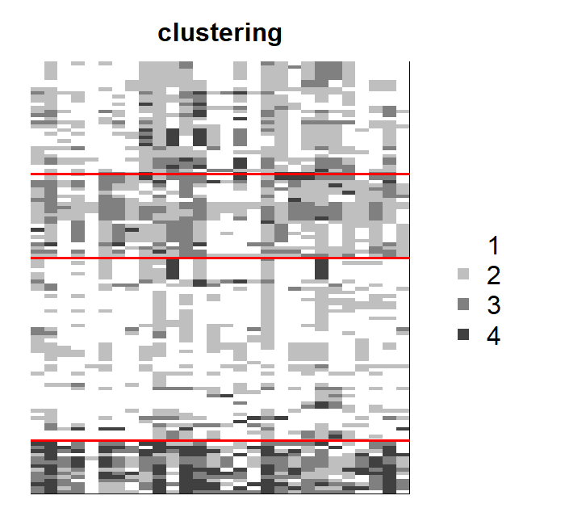
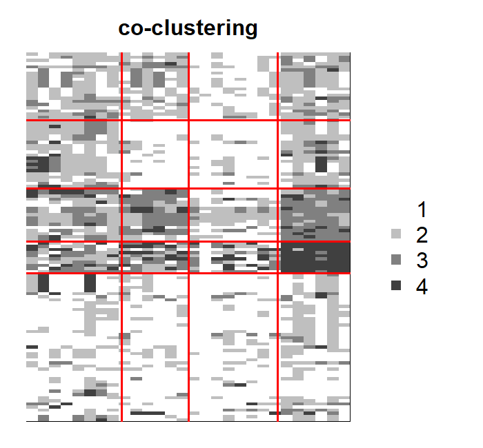
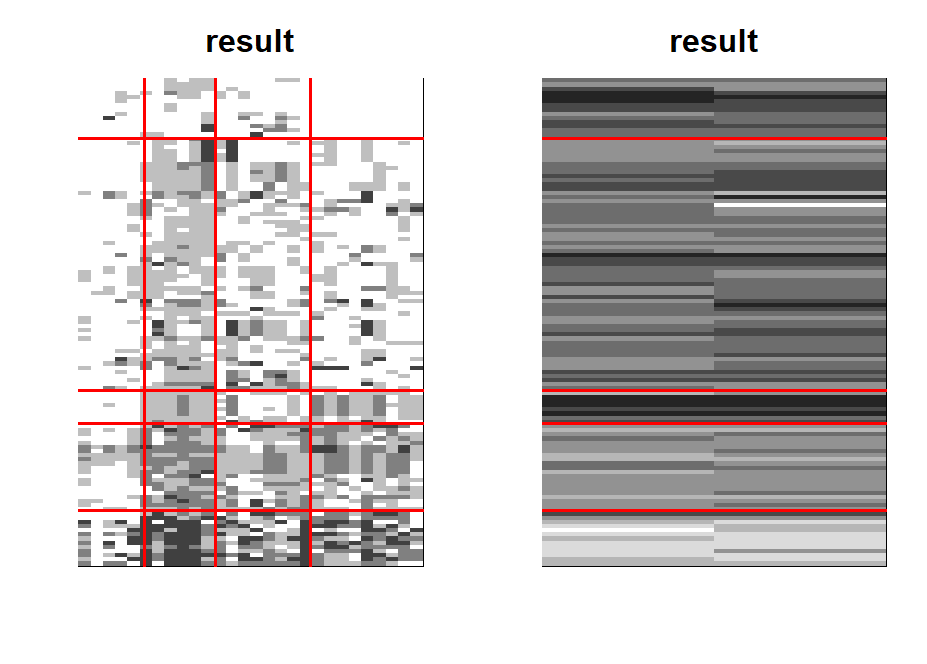

## Description

ordinalClust is an R package that allows users to perform classification, clustering and co-clustering of ordinal data. Furthermore, it allows to handle different numbers of levels and missing values. The ordinal data is considered to follow a BOS distribution [@biernacki16], which is specific for this kind of data. The Latent Block Model is used for performing co-clustering [@jacques17].

## Installation
```r
set.seed(5)
```
```r
library(ordinalClust)
```

## Datasets
The package contains real datasets created from [@Anota17]. They concerns quality of life questionnaires for patient affected by breast cancer.

* __dataqol__ is a data.frame with 121 lines such that each line represents a patient and the columns are information about the patient:
    + Id: patient Id
    + q1-q28: responses to 28 questions with number of categories equals to 4
    + q29-q30: responses to 2 questions with number of categories equals to 7

* __dataqol.classif__ is a data.frame with 40 lines such that a line represents a patient, and the columns are information about the patient:
    + Id: patient Id
    + q1-q28: responses to 28 questions with number of categories equals to 4
    + q29-q30: responses to 2 questions with number of categories equals to 7
    + death: if the patient deceased (2) or not (1).

## Univariate Ordinal Data Simulation

To simulate a sample of ordinal data following the BOS distribution, the function **pejSim** is used.

### Basic example code

This snippet creates a sample of ordinal data with 7 categories, that follows a BOS distribution parametrized by mu=5 and pi=0.5:
```r
m=7
nr=10000
mu=5
pi=0.5

probaBOS=rep(0,m)
for (im in 1:m) probaBOS[im]=pejSim(im,m,mu,pi)
M <- sample(1:m,nr,prob = probaBOS, replace=TRUE)
```

### Plotting

To plot the resulting distribution, the **ggplot2** library can be used.

```r
# loading ggplot2
library(ggplot2)

# changing M as a dataframe
M <- as.data.frame(M)

# Defining the colors for the 7 categories:
cbPalette <- c("#560303", "#a30606", "#ceac18", "#e0e00d", "#f7f313", "#9bf713", "#0de037")

# Creating the histogram plot
plot1 <- ggplot(data = M, aes(x = M,fill=factor(M))) +
  geom_histogram() +
  ylim(0, nr) +
  ggtitle("ordinal data with m=7 \n mu=5 and pi=0.5") +
  theme(plot.title = element_text(vjust = -20,hjust = 0.5,size = 18)) +
  scale_x_continuous(breaks=1:7, labels=c(1:7), limits=c(0,8)) +
  scale_fill_manual(values=cbPalette)

plot1
```

```{r  fig.width = 5, warning=FALSE, eval=TRUE, message=FALSE, tidy=TRUE, dev='png', echo=FALSE, fig.show='hold', fig.align='center'}
library(ggplot2)
library(ordinalClust)
m=7
nr=10000

probaBOS=rep(0,m)
for (im in 1:m) probaBOS[im]=pejSim(im,m,5,0.5)
M <- sample(1:m,nr,prob = probaBOS, replace=TRUE)
M <- as.data.frame(M)
cbPalette <- c("#560303", "#a30606", "#ceac18", "#e0e00d", "#f7f313", "#9bf713", "#0de037")
plot1 <- ggplot(data = M, aes(x = M,fill=factor(M))) +
  geom_histogram() +
  ylim(0, nr) +
  ggtitle("ordinal data with m=7 \n mu=5 and pi=0.5") +
  theme(plot.title = element_text(vjust = -20,hjust = 0.5,size = 16)) +
  scale_x_continuous(breaks=1:7, labels=c(1:7), limits=c(0,8)) +
  scale_fill_manual(values=cbPalette)

plot1
```

## Perform clustering

In this section, a clustering is executed with the __dataqol__ dataset. The purpose of performing a clustering is to highlight a structure through the matrix rows.

### Example code
```{r, echo=TRUE, eval=FALSE, message=FALSE, warning=FALSE}

library(ordinalClust)
data("dataqol")
set.seed(5)

# loading the ordinal data
M <- as.matrix(dataqol[,2:29])

m=4

krow = 4

nbSEM=50
nbSEMburn=40
nbindmini=2

object <- bosclust(x=M, kr=krow, m=m, nbSEM=nbSEM,
    nbSEMburn=nbSEMburn, nbindmini=nbindmini)

```

### Plotting the result

```{r echo=TRUE, eval=FALSE, message=FALSE, warning=FALSE}

bosplot(object)

```

```{r  echo=FALSE, out.width = "75%", out.extra='style="display: block;margin: auto;"', fig.cap=""}
library(knitr)    # For knitting document and include_graphics function


```


## Perform co-clustering

### Example code

In this example, a co-clustering is performed with the __dataqol__ dataset. In this case, the interest of co-clustering is to detect an internal struture throughout the rows and the columns of the data.

```{r, echo=TRUE, eval=FALSE, message=FALSE, warning=FALSE}

library(ordinalClust)

# loading the real dataset
data("dataqol")
set.seed(5)

# loading the ordinal data
M <- as.matrix(dataqol[,2:29])


# defining different number of categories:
m=4


# defining number of row and column clusters
krow = 5
kcol = 4

# configuration for the inference
nbSEM=50
nbSEMburn=40
nbindmini=2

# Co-clustering execution
object <- boscoclust(x=M,kr=krow,kc=kcol,m=m,nbSEM=nbSEM,
          nbSEMburn=nbSEMburn, nbindmini=nbindmini)

```

### Plotting the result

This snippet shows how to visualize the resulting co-clustering, with the **bosplot** function:
```{r echo=TRUE, eval=FALSE, message=FALSE, warning=FALSE}

bosplot(object)

```


```{r  echo=FALSE, out.width = "75%", out.extra='style="display: block;margin: auto;"', fig.cap=""}
library(knitr)    # For knitting document and include_graphics function


```


## Perform classification
In this section, the dataset **dataqol.classif** is used. It contains the responses to a questionnaire for 40 patients affected by breast cancer. Furhermore, a column called **death** indicates if the patient died from the disease (2) or not (1). The aim of this section is to predict the classes of a validation dataset from a training dataset.

### Choosing a good kc parameter with cross-validation

The classification function **bosclassif** proposes two classification models. The first one, (chosen by the option kc=0), is a multivariate BOS model assuming that, conditionally on the class of the observations, the feature are independent.
The second model is a parsimonious version of the first model. Parcimony is introduced by grouping the features into clusters (as in co-clustering) and assuming that the features of a cluster have a common distribution. The number L of clusters of features is defined with the option kc=L. In practice L can be chosen by cross-validation, as in the following example:


```{r, echo=TRUE, message=FALSE, warning=FALSE}

library(ordinalClust)
# loading the real dataset
data("dataqol.classif")

set.seed(5)

# loading the ordinal data
M <- as.matrix(dataqol.classif[,2:29])

# creating the classes values
y <- as.vector(dataqol.classif$death)


# sampling datasets for training and to predict
nb.sample <- ceiling(nrow(M)*2/3)
sample.train <- sample(1:nrow(M), nb.sample, replace=FALSE)

M.train <- M[sample.train,]
M.validation <- M[-sample.train,]
nb.missing.validation <- length(which(M.validation==0))


y.train <- y[sample.train]
y.validation <- y[-sample.train]

# number of classes to predict
kr <- 2

# configuration for SEM algorithm
nbSEM=50
nbSEMburn=40
nbindmini=2


# different kc to test with cross-validation
kcol <- c(0,1,2,3)
m <- 4

# matrix which contains the predictions for all different kc
predictions <- matrix(0,nrow=length(kcol),ncol=nrow(M.validation))

for(kc in 1:length(kcol)){
  res <- bosclassif(x=M.train, y=y.train, to.predict=M.validation, 
                    kr, kc=kcol[kc], m=m, nbSEM=nbSEM, 
                    nbSEMburn=nbSEMburn, nbindmini=nbindmini)
  predictions[kc,] <- res$zr.to.predict
}

predictions = as.data.frame(predictions)
row.names <- c()
for(kc in kcol){
  name= paste0("kc=",kc)
  row.names <- c(row.names,name)
}
rownames(predictions)=row.names
```


### Computing the precision, sensitivity and specificity rates for each kc

```{r, echo=TRUE, message=FALSE, warning=FALSE}

library(caret)

actual <- y.validation -1


precisions <- rep(0,length(kcol))
recalls <- rep(0,length(kcol))
sensitivities <- rep(0,length(kcol))
specificities <- rep(0,length(kcol))

for(i in 1:length(kcol)){
  prediction <- unlist(as.vector(predictions[i,])) -1
  conf_matrix<-table(prediction,actual)
  precisions[i] <- precision(conf_matrix)
  recalls[i] <- recall(conf_matrix)
  sensitivities[i] <- sensitivity(conf_matrix)
  specificities[i] <- specificity(conf_matrix)
}

```

```{r, echo=TRUE, message=FALSE, warning=FALSE}

precisions
recalls
sensitivities
specificities

```

## Handling different numbers of categories

The package allows the user to deal with ordinal data that have different numbers of categories. In this section, we show how to introduce this kind of datasets in the co-clustering context.

### Example code

In this example, co-clustering is performed with the dataset **dataqol**, by including the questions with 4 categories, and questions with 7 categories. The function **boscoclustMulti** is executed, and **it might take a few minutes**.

```{r, echo=TRUE, eval=FALSE, message=FALSE, warning=FALSE}

library(ordinalClust)

# loading the real dataset
data("dataqol")
set.seed(5)

# loading the ordinal data
M <- as.matrix(dataqol[,2:31])


# defining different number of categories:
m=c(4,7)


# defining number of row and column clusters
krow = 5
kcol = c(4,1)

# configuration for the inference
nbSEM=70
nbSEMburn=50
nbindmini=2

d.list <- list(1:28,29:30)

# Co-clustering execution
object <- boscoclustMulti(x=M,kr=krow,kc=kcol,m=m, d.list=d.list,
                    nbSEM=nbSEM,nbSEMburn=nbSEMburn,
                     nbindmini=nbindmini, init='kmeans',disp=T)

```

<!-- ### Plotting the result -->

<!-- This snippet shows how to visualize the resulting co-clustering, with the **bosplot** function: -->
<!-- ```{r echo=TRUE, eval=FALSE, message=FALSE, warning=FALSE} -->

<!-- bosplot(object) -->

<!-- ``` -->

<!-- ```{r  echo=FALSE, out.width = "75%", out.extra='style="display: block;margin: auto;"', fig.cap=""} -->
<!-- library(knitr)    # For knitting document and include_graphics function -->

<!--  -->
<!-- ``` -->


In case of clustering and classification the **bosclustMulti** and **bosclassifMulti** functions are used with equivalent changes.

## References


